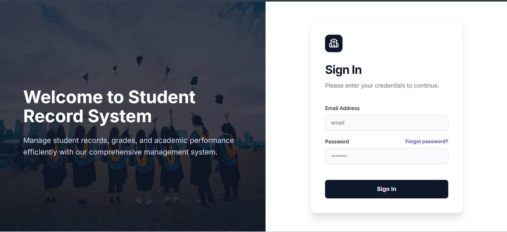
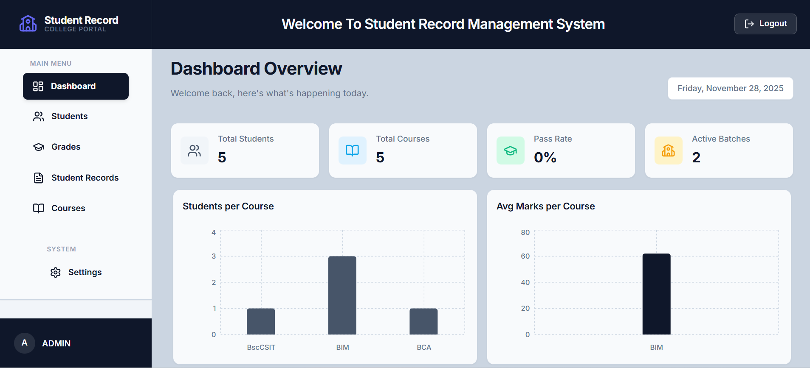
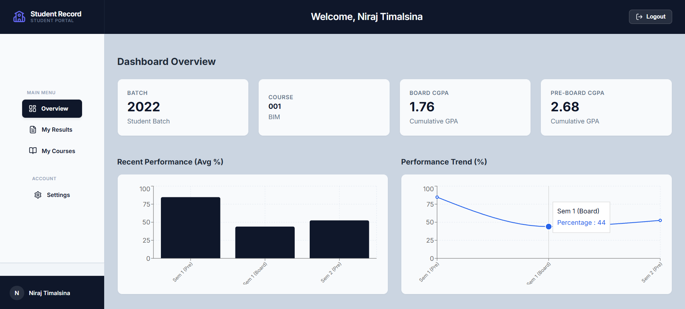

# Student Record Management System

A comprehensive web-based application for managing student records, courses, and exam results. Built with the MERN stack (MongoDB, Express.js, React, Node.js), this system streamlines academic administration and provides students with easy access to their performance data.

##  Features

###  Role-Based Access Control
- **Admin:**
  - Register and manage student accounts.
  - Create and configure Courses, Semesters, and Subjects.
  - Input and manage student marks for Board and Pre-Board exams.
  - View comprehensive dashboard statistics (Pass rates, Batch distribution, etc.).
  - Create other Admin accounts.
- **Student:**
  - Secure login with role-specific dashboard.
  - View personal academic results and GPA calculations.
  - Access course curriculum and subject details.
  - Visual analytics of performance trends over semesters.
  - Update password and profile settings.

###  Dashboard & Analytics
- Interactive charts using `Recharts` to visualize student performance and system statistics.
- Real-time overview of total students, courses, and active batches.

###  Modern & Resilient
- **Progressive Web App (PWA):** Fully offline-compatible. Users can access cached data even without an internet connection.
- **Responsive Design:** Optimized interface for both desktop and mobile devices.
- **Security:** Implements JWT authentication, password hashing (Bcrypt), and secure HTTP headers (Helmet).

## Screenshots

| Login Page | Admin Dashboard |
|:---:|:---:|
|  |  |
| **Student Dashboard** | |
|  | |

##  Tech Stack

### Frontend
- **Framework:** React (Vite)
- **Styling:** Custom CSS, Lucide React (Icons)
- **Charts:** Recharts
- **PWA:** Vite Plugin PWA
- **Routing:** React Router DOM

### Backend
- **Runtime:** Node.js
- **Framework:** Express.js
- **Database:** MongoDB (with Mongoose ODM)
- **Authentication:** JSON Web Tokens (JWT)
- **Optimization:** Compression, Helmet, Morgan

##  Installation & Setup

### Prerequisites
- Node.js (v14 or higher)
- MongoDB (Local or Atlas connection string)

### 1. Clone the Repository
```bash
git clone <repository-url>
cd Student-Record
```

### 2. Backend Setup
Navigate to the backend folder and install dependencies:
```bash
cd backend
npm install
```

Create a `.env` file in the `backend` directory:
```env
PORT=5000
MONGO_URI=mongodb://localhost:27017/student-record
JWT_SECRET=your_super_secret_key_here
```

### 3. Frontend Setup
Navigate to the frontend folder and install dependencies:
```bash
cd ../frontend
npm install
```

##  Running the Application

You need to run both the backend server and the frontend client.

### Start Backend
```bash
cd backend
npm run dev
# Server runs on http://localhost:5000
```

### Start Frontend
```bash
cd frontend
npm run dev
# Client runs on http://localhost:5173
```

##  Project Structure

```
Student-Record/
├── backend/                # Node.js/Express Server
│   ├── controllers/        # Request handlers
│   ├── models/             # Mongoose schemas (User, Course, ExamResult)
│   ├── routes/             # API routes
│   └── server.js           # Entry point
│
├── frontend/               # React Application
│   ├── public/             # Static assets & PWA icons
│   ├── src/
│   │   ├── App.jsx         # Main application component & Routing
│   │   ├── index.css       # Global styles
│   │   └── main.jsx        # React entry point
│   └── vite.config.js      # Vite & PWA configuration
│
└── README.md               # Project documentation
```

##  Database Seeding & Default Access

Since public registration is disabled for security, you need to seed the database with an initial Admin account when setting up the project for the first time.

1. **Run the Seeder Script:**
   Navigate to the backend folder and run:
   ```bash
   cd backend
   npm run seed
   ```

2. **Login with Default Credentials:**
   - **Email:** `admin@example.com`
   - **Password:** `admin123`

   *Note: Please change this password immediately after logging in via the Settings page.*

##  Contributing
Contributions, issues, and feature requests are welcome!

##  License
This project is open-source and available under the [MIT License](LICENSE).
